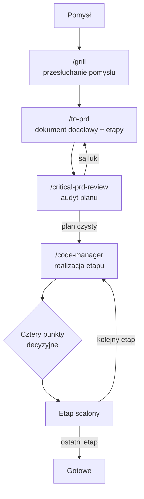

# Start — jak pracujesz z metodologią

To jedyny przewodnik, którego potrzebujesz, żeby zacząć. Opisuje **proces** — kto co robi, kiedy Ty wchodzisz do gry, jak prowadzisz pracę od pomysłu do gotowej zmiany. Szczegóły wykonawcze każdego etapu żyją w skillach (to spakowane przepisy na konkretny etap pracy — odpalasz je wpisując `/nazwa`, np. `/code-manager`). Agent zna te skille i sam po nich prowadzi. Ten dokument jest po to, żebyś **rozumiał** proces, nie żebyś go pamiętał.

## Co to jest i po co

Pracujesz nad kodem z pomocą AI. Model AI ma dwa ograniczenia, które kształtują cały sposób pracy. Po pierwsze — jest najbystrzejszy na początku rozmowy i gubi się, gdy rozmowa robi się długa. Po drugie — nie pamięta nic z poprzedniej rozmowy; każda nowa sesja zaczyna od zera.

Metodologia bierze to pod uwagę. Wszystko, co ważne (decyzje, ustalenia, plany, słownik projektu), trzymamy w plikach na dysku — nie w pamięci rozmowy. Pracę dzielimy na krótkie, samodzielne etapy, żeby każdy mieścił się w tym „bystrym" oknie. A jakości pilnuje nie jeden agent, tylko zespół: jeden pisze kod, drugi go sprawdza, a Ty testujesz efekt i decydujesz, co jest dobre.

W praktyce nie robisz tego ręcznie. Odpalasz agenta-**Managera**, który prowadzi cały proces: planuje, rozdziela pracę, zleca przegląd kodu i porządkuje dokumentację. Ty zostajesz przy tym, co tylko Ty możesz zrobić — testujesz na żywej aplikacji i podejmujesz decyzje.

## Trzej aktorzy

**Ty — właściciel produktu.** Nie musisz czytać kodu. Twoja rola to podejmować decyzje i oceniać efekt: czy to działa, czy wygląda dobrze, czy o to Ci chodziło. Masz ostatnie słowo przed każdą zmianą, której nie da się łatwo cofnąć.

**Manager — agent, który prowadzi proces.** Sam nie pisze kodu produktu. Planuje pracę, uruchamia agentów-wykonawców i przekazuje im zadania, zleca przegląd gotowego kodu, tłumaczy techniczne uwagi na ludzki język i porządkuje dokumentację. Działa autonomicznie — rozmawia z wykonawcami bezpośrednio, więc Ty nie pośredniczysz w przekazywaniu wiadomości.

**Executorzy — agenci wykonawczy.** To oni piszą kod. Manager uruchamia ich w tle i dobiera odpowiedniego wykonawcę do skali zadania. Każdy dostaje plan, czyta odpowiednie pliki, pisze kod i przygotowuje dla Ciebie listę scenariuszy do przetestowania. Raportują do Managera, nie do Ciebie.

## Twoje cztery punkty decyzyjne

W całym procesie są **cztery momenty**, w których praca się zatrzymuje i czeka na Ciebie. To jest sedno Twojej roli — reszta dzieje się bez Ciebie.

**1. Test na żywej aplikacji.** Gdy kod jest gotowy, agent daje Ci listę scenariuszy: co kliknąć i czego się spodziewać. Klikasz, sprawdzasz, oceniasz. Mówisz jedno z trzech: „ok", „popraw to i to" (agent poprawia i wracasz do testu) albo „to jest zepsute" (wraca do przemyślenia).

**2. Decyzja o uwagach z przeglądu.** Osobny agent przegląda gotowy kod i wypisuje słabe punkty. Manager tłumaczy je na to, co Ty odczujesz w aplikacji. Przy każdej uwadze decydujesz: **napraw teraz**, **zapisz na później** (trafia do listy zadań) albo **świadomie pomiń**.

**3. Ponowny test po poprawkach.** Tylko jeśli coś było naprawiane. Klikasz jeszcze raz te miejsca, których dotknęły poprawki — nie całą aplikację od nowa.

**4. Zgoda na scalenie.** Manager pyta „merge?". Piszesz „akcept" i dopiero wtedy zmiana zostaje scalona. Bez Twojej zgody nic się nie scala — to punkt bez odwrotu, więc zawsze należy do Ciebie.

Przegląd kodu nie kręci się w kółko: jeśli po dwóch rundach poprawek nadal nie ma zgody, decyzja co dalej wraca do Ciebie.

## Trzy ścieżki — wybierz wg skali

Wszystko zaczyna się od jednego pytania: jak duże jest to, co chcesz zrobić.

### Mały task

**Kiedy:** pojedyncza zmiana o jasnym celu — poprawka błędu, drobny refactor, mała funkcja. Typowo 1-3 pliki. Jeśli **nie jesteś pewien, czy to mały task — to nie jest mały task** (idź do dużej inicjatywy).

1. **Ty:** wpisujesz `/code-manager` i mówisz, co chcesz zmienić.
2. **Manager:** ocenia skalę, pisze plan pracy i uruchamia agenta-wykonawcę z tym planem.
3. **Executor:** czyta plan i pliki, pisze kod, przygotowuje scenariusze do testu.
4. **Ty:** przechodzisz przez cztery punkty decyzyjne (test → uwagi z przeglądu → ewentualny re-test → zgoda na scalenie).
5. **Manager:** po Twoim „akcept" scala zmianę i porządkuje dokumentację.

Dla prawdziwego drobiazgu (literówka, jednoplikowa poprawka) nie musisz uruchamiać całego procesu — powiedz agentowi wprost, sprawdź wynik, gotowe.

### Duża inicjatywa

**Kiedy:** nowy moduł, duża funkcja, refactor dotykający wielu miejsc, praca na kilka dni. Cel nie jest oczywisty — trzeba go najpierw dobrze przemyśleć. Sygnał: „to wprowadza nowe pojęcie", „to zmienia sposób, w jaki dane przechodzą przez system".

Tu nie skaczesz od razu do pisania kodu. Najpierw plan, potem audyt planu, dopiero potem realizacja — etap po etapie.

1. **Ty:** `/grill` — agent przesłuchuje Twój pomysł pytaniami, aż oboje rozumiecie problem **tak samo**. To najważniejszy krok; nie skracaj go.
2. **Ty:** `/to-prd` — agent spisuje ustalenia w dokument docelowy: opis celu plus podział na cienkie, samodzielne etapy (każdy da działającą wartość).
3. **Ty:** `/critical-prd-review` — inny agent audytuje ten dokument i szuka luk (bezpieczeństwo, skala, architektura), zanim powstanie kod. Poprawiasz, aż plan jest czysty. Tanie minuty tutaj oszczędzają godziny przepisywania kodu później.
4. **Ty:** `/code-manager` — Manager bierze pierwszy etap: najpierw sam rozpisuje go na konkretne zadania z kryteriami ukończenia (robi to komendą `/to-tasks` — Ty jej nie wpisujesz), a potem prowadzi etap przez pełen cykl małego taska (plan → kod → Twoje cztery punkty → scalenie).
5. Powtarzasz krok 4 dla kolejnych etapów, aż całość jest gotowa.

### Bug

**Kiedy:** coś działa źle, a nie wiadomo dlaczego. Gdyby przyczyna była oczywista, poprawka też byłaby trywialna.

1. **Ty:** `/diagnose` i opisujesz objaw — co się dzieje, kiedy, na jakich danych.
2. **Executor:** buduje szybki, powtarzalny sposób wywołania błędu. To najważniejszy krok — bez tego naprawianie to zgadywanie.
3. **Executor:** stawia hipotezy, testuje je po kolei, znajduje prawdziwą przyczynę (nie tylko objaw).
4. **Executor:** naprawia i dodaje test, który złapie ten błąd, gdyby wrócił.
5. **Ty:** sprawdzasz, że objaw zniknął.

Jeśli buga prowadzisz przez `/code-manager` (bo chcesz przegląd i kontrolę nad scaleniem), po naprawie wchodzi ten sam cykl czterech punktów co przy małym tasku.

## Nie musisz tego pamiętać

Nie odtwarzaj tego schematu z pamięci. W praktyce wpisujesz `/code-manager` i mówisz, co chcesz osiągnąć — agent zna proces. Sam rozpozna skalę, wskaże brakujący krok („zacznijmy od `/grill`") i poprowadzi Cię dalej, punkt po punkcie. Ten dokument jest po to, żebyś rozumiał, **dlaczego** proces wygląda tak, jak wygląda, i wiedział, czego się spodziewać w każdym z czterech punktów decyzyjnych.

## Wariant dwóch okien

Domyślnie Manager rozmawia z wykonawcami sam i Ty nic nie przenosisz między oknami. Jeśli wolisz prowadzić wykonawcę w osobnym oknie albo w innym narzędziu, Manager sformatuje każdą wiadomość jako gotowy blok do wklejenia — to tryb awaryjny, nie domyślny.

## Dalej

- [02-zasady-metodologii.md](./02-zasady-metodologii.md) — zasady, które stoją za tym procesem (dlaczego krótkie sesje, dlaczego cienkie etapy, dlaczego test przed przeglądem).
- [03-pliki-projektu.md](./03-pliki-projektu.md) — co leży na dysku: słownik projektu, lista zadań, plany, kroniki, decyzje.
- [07-instalacja.md](./07-instalacja.md) — jak zainstalować skille.
